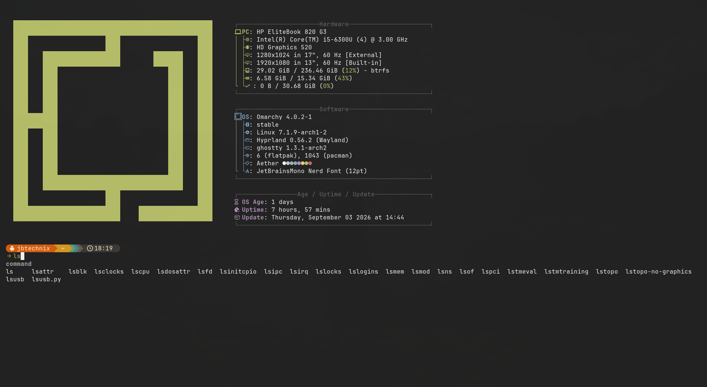

# Smart Zsh for Linux

A polished Arch Linux terminal setup for Ghostty, based on the workflow demonstrated in the referenced terminal-customization video and adapted for Omarchy.



## What It Provides

- Zsh as the interactive shell.
- Starship prompt with OS, user, directory, time, Git, language, and status segments.
- JetBrainsMono Nerd Font and a dark `#222222` Ghostty canvas.
- Fastfetch system banner at shell startup.
- Atuin fuzzy history search on Up and Ctrl-R.
- Grey history-based autosuggestions.
- Syntax highlighting from `zsh-syntax-highlighting`.
- Live, as-you-type completion from the Arch `zsh-autocomplete` package.
- Descriptions for command options and subcommands.
- Completion examples such as `ls -`, `find /var/log -`, `cd /tmp/`, `git ch`, and `systemctl sta`.

## Screenshots

- [Live option completion](assets/live-completion-options.png)
- [Live file completion](assets/live-file-completion.png)
- [Live menu selection](assets/live-menu-selection.png)
- [Final prompt and Fastfetch](assets/final-prompt.png)

## Architecture

The order in `configs/zshrc` is intentional:

1. Starship initializes first.
2. Atuin initializes history search.
3. Autosuggestions loads grey history text.
4. Syntax highlighting loads colored command feedback.
5. `zsh-autocomplete` loads last and owns the completion redraw widgets.

All plugins are installed from Arch packages. This project does not require a GitHub clone, Oh My Zsh, fzf-tab, manual `compinit`, or Kitty-specific behavior.

## Install

See [docs/MANUAL-SETUP.md](docs/MANUAL-SETUP.md) for the complete procedure. The short version on Arch is:

The one-command installer is the recommended path:

```sh
./setup.sh
```

Run individual stages when needed:

```sh
./setup.sh packages
./setup.sh configs
./setup.sh shell
./setup.sh verify
```

The script never stores or accepts passwords; `sudo` prompts normally when package installation needs it.


```sh
sudo pacman -S --needed zsh zsh-autocomplete zsh-autosuggestions zsh-syntax-highlighting atuin starship fastfetch
chsh -s /usr/bin/zsh
```

Copy the configuration files into place:

```sh
cp configs/zshrc ~/.zshrc
mkdir -p ~/.config/ghostty ~/.config
cp configs/ghostty.config ~/.config/ghostty/config.ghostty
cp configs/starship.toml ~/.config/starship.toml
cp configs/atuin.config.toml ~/.config/atuin/config.toml
exec zsh
```

Open a new Ghostty window after changing its configuration.

## Verification

Type each command slowly and pause. Do not press Tab:

```sh
ls -
find /var/log -
cd /tmp/
git ch
systemctl sta
```

The completion list should appear below the prompt. Up should open Atuin history search, valid commands should be highlighted, and a fresh shell should show Fastfetch.

## Compatibility

This configuration targets Arch Linux or Omarchy, Zsh 5.9+, Ghostty, and a Nerd Font. Package paths may differ on Debian, Fedora, macOS, or other systems. Keep the plugin order and replace package paths with the paths supplied by that platform.

## Troubleshooting

- Confirm the current shell with `printf '%s\\n' "$SHELL"` and `ps -p $$ -o args=`.
- Confirm the plugin is installed with `pacman -Q zsh-autocomplete`.
- Confirm the active entrypoint with `pacman -Ql zsh-autocomplete | grep plugin.zsh`.
- Check syntax with `zsh -n ~/.zshrc`.
- Reload with `exec zsh`, or open a new Ghostty window.
- Test `ls -`, not only `ls`; the option word activates option completion.
- If the menu is missing, temporarily remove other ZLE plugins and restore them in the documented order.
- Do not add a second `compinit`, source `oh-my-zsh.sh`, or add `fzf-tab` for this live-menu behavior.

## Files

- `configs/zshrc`: working Zsh startup configuration.
- `configs/ghostty.config`: Ghostty appearance configuration.
- `configs/starship.toml`: Starship prompt theme.
- `configs/atuin.config.toml`: local Atuin search settings.
- `setup.sh`: one-command installer with package, config, shell, and verification stages.
- `docs/MANUAL-SETUP.md`: detailed human setup and recovery guide.
- `docs/AI-PROMPT.md`: prompt for reproducing this setup with an AI coding agent.
- `assets/`: screenshots of the verified result.

## License

Use, adapt, and share the configuration freely. The bundled configuration is provided as-is; third-party packages retain their own licenses.
